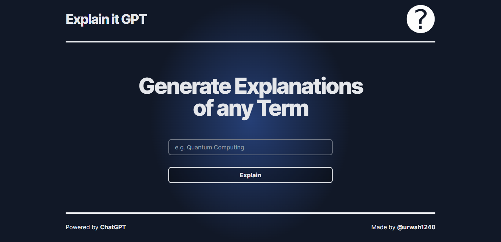

# [explain-it-gpt.vercel.app](https://explain-it-gpt.vercel.app)

This project generates explanations of the Term that is entered by the User.

[](https://explain-it-gpt.vercel.app)

## How it works

This project uses the [ChatGPT API](https://openai.com/api/). It constructs a prompt based on the form and user input, sends it to the chatGPT API, then sends the response back to the application.

## Running Locally

After cloning the repo, go to [OpenAI](https://beta.openai.com/account/api-keys) to make an account and put your API key in a file called `.env.local`.

Then, run the application in the command line and it will be available at `http://localhost:3000`.

```bash
npm run dev
```